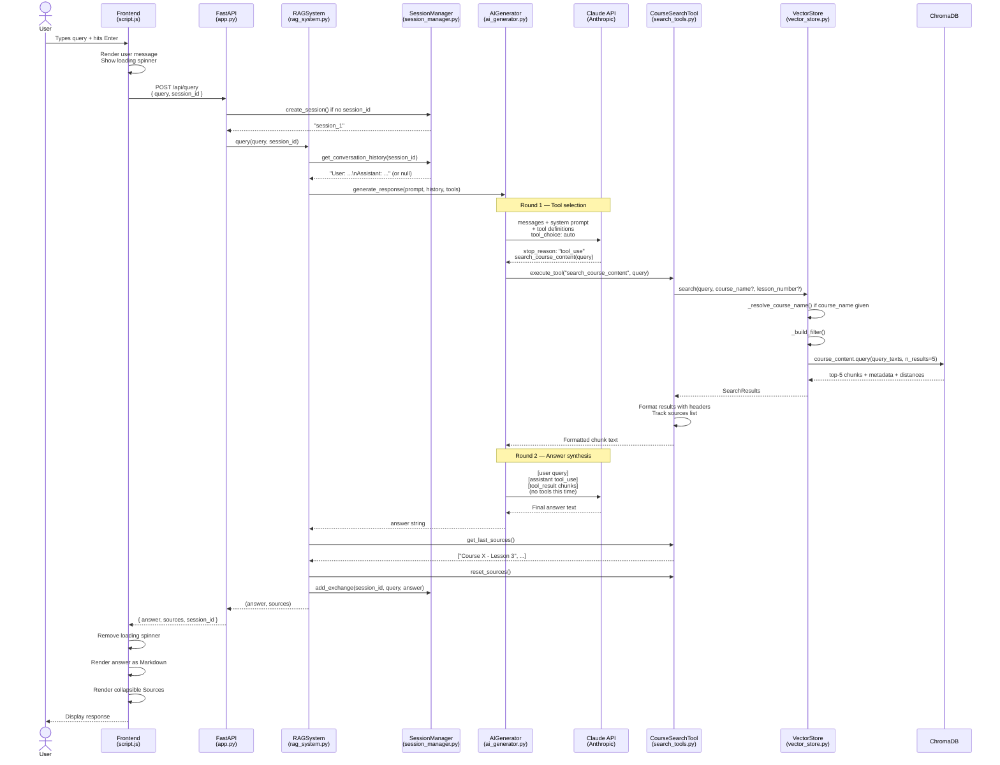

# RAG Chatbot Request Flow

```mermaid
sequenceDiagram
    actor User
    participant UI as Frontend<br/>(script.js)
    participant API as FastAPI<br/>(app.py)
    participant RAG as RAGSystem<br/>(rag_system.py)
    participant Session as SessionManager<br/>(session_manager.py)
    participant AI as AIGenerator<br/>(ai_generator.py)
    participant Claude as Claude API<br/>(Anthropic)
    participant Tool as CourseSearchTool<br/>(search_tools.py)
    participant VS as VectorStore<br/>(vector_store.py)
    participant DB as ChromaDB

    User->>UI: Types query + hits Enter
    UI->>UI: Render user message<br/>Show loading spinner
    UI->>API: POST /api/query<br/>{ query, session_id }

    API->>Session: create_session() if no session_id
    Session-->>API: "session_1"

    API->>RAG: query(query, session_id)

    RAG->>Session: get_conversation_history(session_id)
    Session-->>RAG: "User: ...\nAssistant: ..." (or null)

    RAG->>AI: generate_response(prompt, history, tools)

    Note over AI,Claude: Round 1 — Tool selection
    AI->>Claude: messages + system prompt<br/>+ tool definitions<br/>tool_choice: auto
    Claude-->>AI: stop_reason: "tool_use"<br/>search_course_content(query)

    AI->>Tool: execute_tool("search_course_content", query)
    Tool->>VS: search(query, course_name?, lesson_number?)

    VS->>VS: _resolve_course_name() if course_name given
    VS->>VS: _build_filter()
    VS->>DB: course_content.query(query_texts, n_results=5)
    DB-->>VS: top-5 chunks + metadata + distances
    VS-->>Tool: SearchResults

    Tool->>Tool: Format results with headers<br/>Track sources list
    Tool-->>AI: Formatted chunk text

    Note over AI,Claude: Round 2 — Answer synthesis
    AI->>Claude: [user query]<br/>[assistant tool_use]<br/>[tool_result chunks]<br/>(no tools this time)
    Claude-->>AI: Final answer text

    AI-->>RAG: answer string

    RAG->>Tool: get_last_sources()
    Tool-->>RAG: ["Course X - Lesson 3", ...]
    RAG->>Tool: reset_sources()

    RAG->>Session: add_exchange(session_id, query, answer)

    RAG-->>API: (answer, sources)
    API-->>UI: { answer, sources, session_id }

    UI->>UI: Remove loading spinner
    UI->>UI: Render answer as Markdown
    UI->>UI: Render collapsible Sources
    UI-->>User: Display response
```
